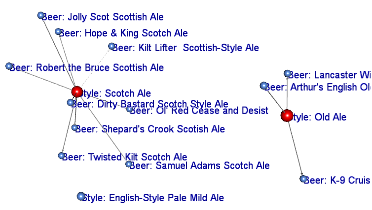

<br>
<br>
<br>
<br>

## Beer Recommendation Eengine
#### Coursera Project
<small> Created by Marius Radu / [@radmar2002](https://twitter.com/radmar2002) </small>

---.class #id

## What is about?

1. It's a Toy Application

2. It's a 'micro' engine based on beer characteristics similarities; it contains nice functions but it is not cutting-age recommndation technology

3. It ilustrates the usage of some nice R libraries as: "rgl", "igraph" or "stringdist"

4. It might be fun  :)


--- .class #id 

## Sample Output

As outcome you can see the cluster of similar beers with your favorite one.



--- .class #id 

## Sample Code

One of the key functions from the application

```{r echo=FALSE,results ='hide'}

df <- read.csv("BeersForApplicationMain.csv")

```

```{r eval=TRUE}
library(stringdist)
beerName <- c("Powder Hound Winter Ale",
              "K-9 Cruiser Winter Ale",
              "Jolly Scot Scottish Ale",               
              "Samuel Adams Scotch Ale",
              "Twisted Kilt Scotch Ale",
              "Highland Scottish Ale")
# we use Optimal String Alignment distance to measure names similarity
D <- stringdistmatrix(beerName, beerName, method=c("osa")) 
D <- as.data.frame(D)
rownames(D) <- beerName
# Similiarity matrix between the names of the beers
D

```

--- .class #id 


## Thank you!

- Want to see the application?

<small>[http://radmar.shinyapps.io/RecommendApp/](http://radmar.shinyapps.io/RecommendApp/)</small>

- Want to see the source?

<small>[https://github.com/radmar2002/Beer-Recommendation-Engine](https://github.com/radmar2002/Beer-Recommendation-Engine)</small>

- Want to write me?

<small>[radu_marius_florin@yahoo.com](radu_marius_florin@yahoo.com)</small>


